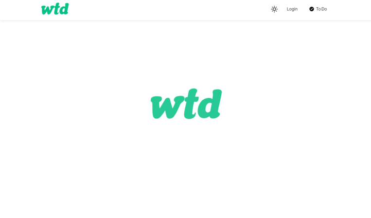
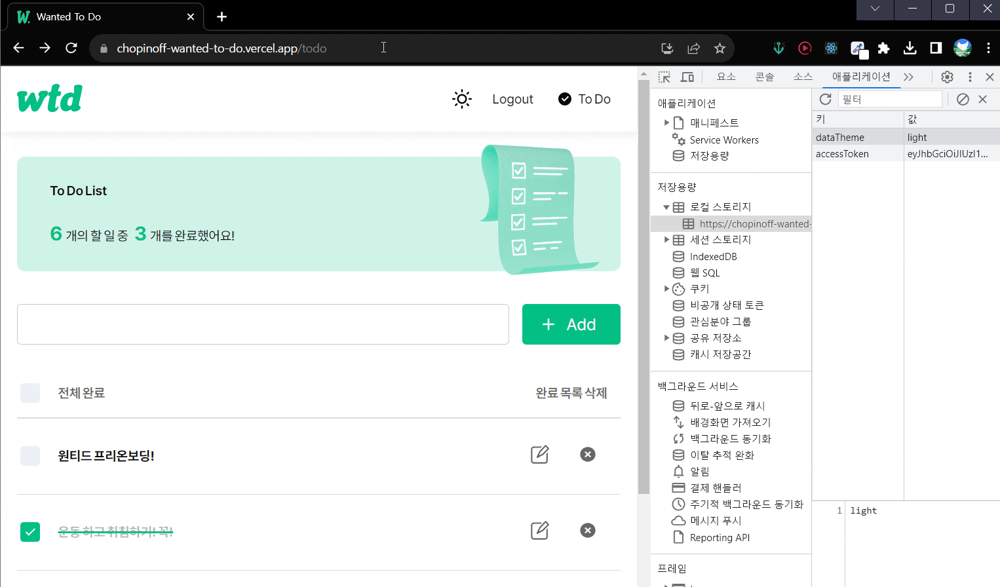
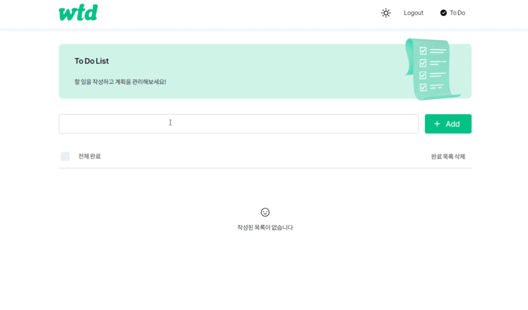
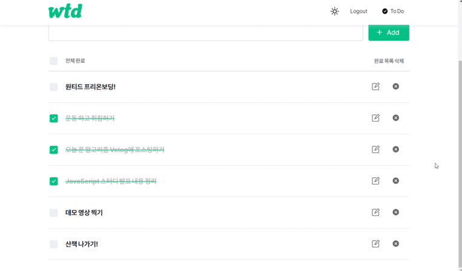
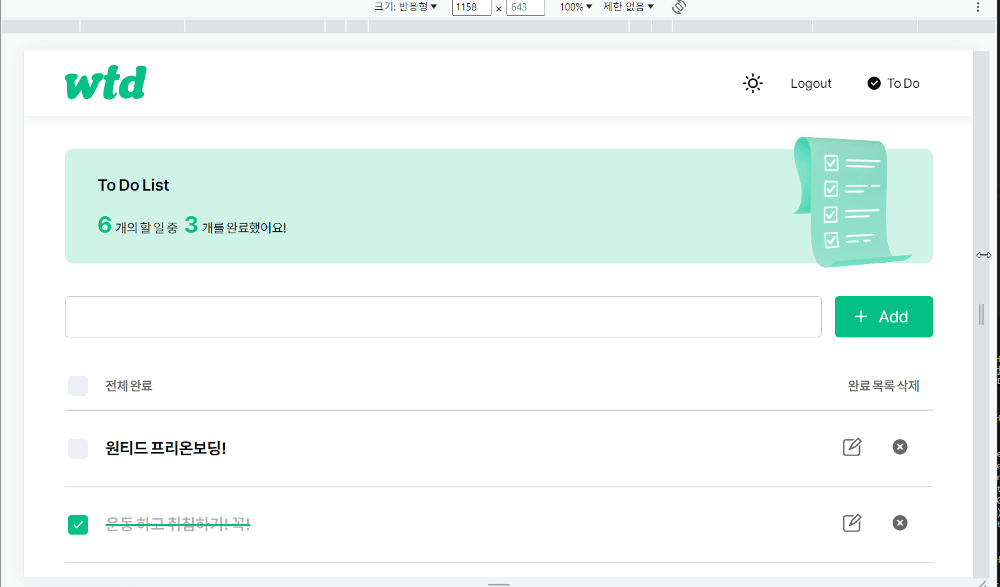
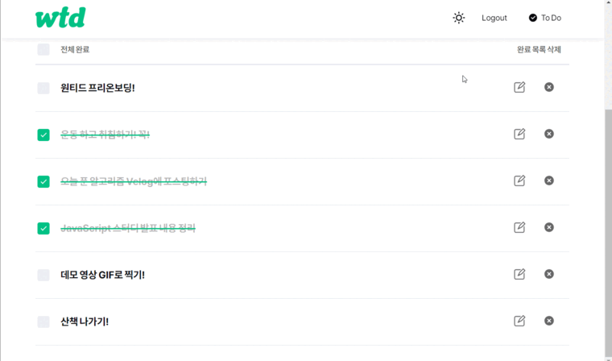

# Wanted To Do


<br>
<br>

## 지원자 이름

김현영

## 배포 링크

[**https://chopinoff-wanted-to-do.vercel.app/**](https://chopinoff-wanted-to-do.vercel.app/)

## 실행 방법

```
git clone https://github.com/chopinoff/wanted-pre-onboarding-frontend.git

cd todo-app

npm start
```

## 데모 영상

데모 영상은 모두 배포 환경에서 녹화되었습니다

### 1. 로그인 / 회원가입 (Assignment 1, 2, 3, 4)

- 회원가입과 로그인 페이지에 이메일과 비밀번호의 유효성 검사기능 구현

- 회원가입이 정상적으로 완료되었을 시 `/signin` 경로로 이동

- 로그인이 정상적으로 완료되었을 시 `/todo` 경로로 이동

  

- 로그인 여부에 따른 리다이렉트 처리 구현

  

### 2. TODO (Assignment 5, 6, 7, 8, 9, 10)

- TODO의 내용과 완료 여부 표시
- 리스트 페이지에 새로운 TODO를 입력할 수 있는 input과 추가 button 구현
- TODO의 체크박스를 통해 완료 여부 수정 기능 구현
- TODO 삭제 기능 구현

  

- TODO 수정 모드 및 수정 제출 / 취소 기능 구현

  

### 3. 추가 기능 구현

- 기기 환경에 따른 반응형 웹으로 제작 (DeskTop, Tablet, Mobile)

  

- 다크모드 추가

  

## 사용 라이브러리 목록

```json
    "@emotion/babel-preset-css-prop": "^11.11.0",
    "@emotion/react": "^11.11.1",
    "@testing-library/jest-dom": "^5.17.0",
    "@testing-library/react": "^13.4.0",
    "@testing-library/user-event": "^13.5.0",
    "@types/jest": "^27.5.2",
    "@types/node": "^16.18.39",
    "@types/react": "^18.2.18",
    "@types/react-dom": "^18.2.7",
    "axios": "^1.4.0",
    "craco": "^0.0.3",
    "react": "^18.2.0",
    "react-dom": "^18.2.0",
    "react-icons": "^4.10.1",
    "react-responsive": "^9.0.2",
    "react-router-dom": "^6.14.2",
    "react-scripts": "5.0.1",
    "typescript": "^4.9.5",
    "web-vitals": "^2.1.4"
```
