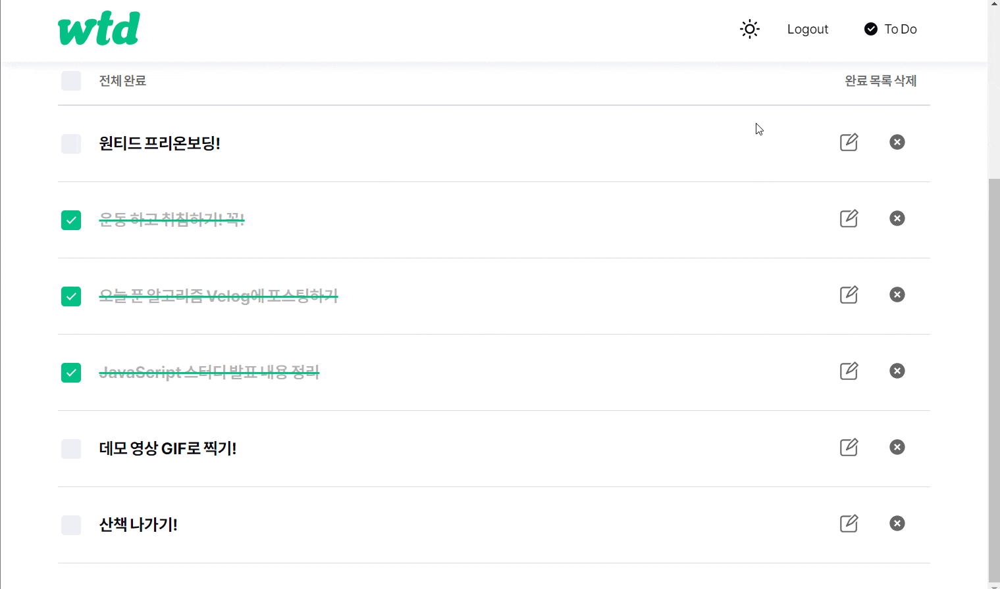

# Wanted To Do

## 지원자 정보

김현영 (@chopinoff)

## 배포 링크

[**https://chopinoff-wanted-to-do.vercel.app/**](https://chopinoff-wanted-to-do.vercel.app/)

## 실행 방법

```
git clone

cd todo-app

npm start
```

## 데모 영상

- 데모 영상은 모두 배포 환경에서 녹화되었습니다.

### 1. 로그인 / 회원가입 (Assignment 1, 2, 3, 4)

- 회원가입과 로그인 페이지에 이메일과 비밀번호의 유효성 검사기능 구현
- 회원가입 페이지에서 버튼을 클릭 시 회원가입을 진행하고 회원가입이 정상적으로 - 로그인이 정상적으로 완료되었을 시 /todo 경로로 이동
- 로그인 여부에 따른 리다이렉트 처리 구현
  
  
  
  
  
  
